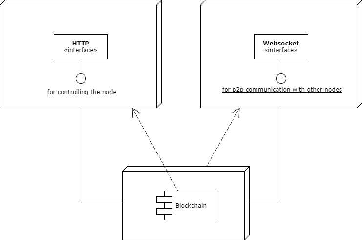

Chainpro
========
Easy Blockchain implementation for JavaScript apps.
  
[](https://travis-ci.org/stremann/chainpro)
[](https://www.npmjs.com/package/chainpro)
[](https://www.npmjs.com/package/chainpro)

### Installation

To install the stable version:

```
npm install --save chainpro
```

This assumes you are using [npm](https://www.npmjs.com/) as your package manager.  
If you don't, you can [access these files on unpkg](https://unpkg.com/chainpro/), download them, or point your package manager to them.

### Quick Start

Set up two connected nodes:

```
HTTP_PORT=3001 P2P_PORT=6001 npm run dev
HTTP_PORT=3002 P2P_PORT=6002 P2P_PEERS=ws://localhost:6001 npm run dev
```

#### HTTP API

- `GET: /chain` -  return current chain of your application.
- `POST: /mine --data {"data": "Some block data"}` -  create new block into the chain.
- `GET: /peers` -  return current peer list of your application.
- `POST: /connect --data {"peer" : "ws://localhost:6002"}` -  add peer to you application.

### Architecture



To get more details check the post on [Medium](https://medium.com/@stremann/blockchain-in-100-lines-of-code-50186a9a230).

### Change Log

This project adheres to [Semantic Versioning](http://semver.org/).
Every release is documented on the GitHub [Releases](https://github.com/stremann/chainpro/releases) page.

### License

MIT
